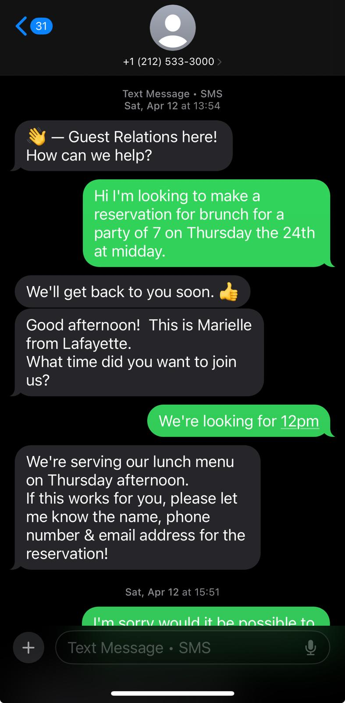
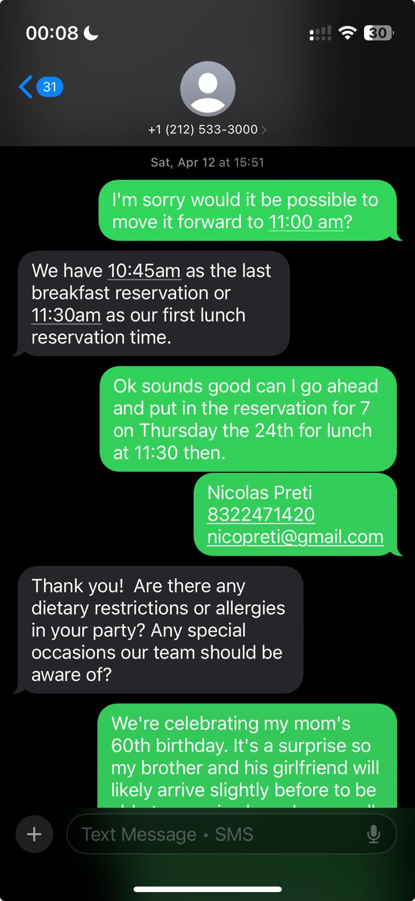
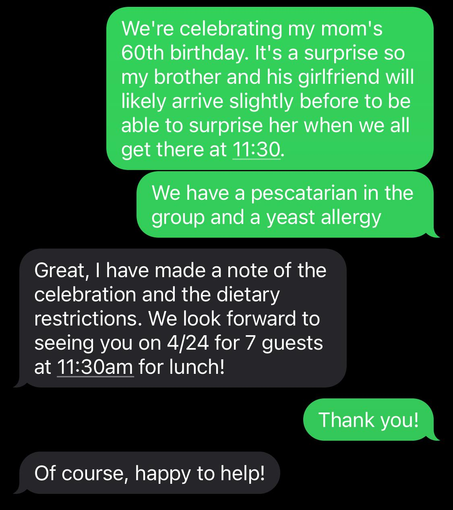
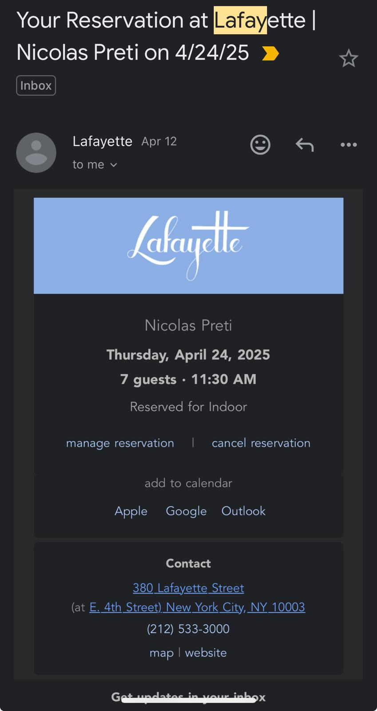

Paso mi primer delightful experience en el restaurant Lafayette de New York. 

### Lafayette

https://www.lafayetteny.com

380 Lafayette St, New York, NY 10003

Primero, la reservación que hicimos fue por mensaje de texto. 
No estaba seguro pero me parecía una IA por el tiempo de respuestas, pero muy bien logrado, puede ser que no lo era, o sea si lo era, pasaba el Turing Test. 

El proceso de reserva en sí me pareció delightful tmbn por comparación. 
Me había costado encontrar un lugar para reservar brunch para 7 personas durante la semana en ny... 
Todos los otros lugares te hacían llamar o escribir un mail con toda una gestión aparte para hacer la reserva, Lafayette no.

Nos preguntaron si festejabamos algo especial, si habían alergias, todo cortito y al pie, pero eran buenas preguntas y nos acomodaron en todo. 
Nos preguntaron si habían algunas otras consideraciones y como era una sorpresa para mi mamá, queríamos que mi hermano esté sentado en la mesa antes de que llegara mi mamá al restaurant. 
Los senataron a mi hermano y a su novia  antes de que abriera el restaurant para sentarlos. 

El servicio desde que nos sentamos fue excepcional. 
Siempre atentos pasaron varias veces pero aún no estabamos listos. 
Les explicamos que hace mucho no nos veíamos y teníamos que hacer catch up y nunca nos apuraron pero siempre cerca para ayudar con cualquier cosa. 
Nunca sentí que los esperamos y sobre todo una forma muy amena con modales ejemplares. 
Atendía a las mujeres por edad primero dsps los varones con muchisima presencia y atención a detalle. 
Los modales me llamó mucho la atención sinceramente, delightful. 

Después la estética del ambiente también: los detalles de los muebles y las luces, la distancia entre las mesas, había gente pero no era demasiado ruidoso. 
Las mesas eran intimas y redondas pero con mucho espacio para todo lo que pedimos para compartir o sea intimo pero no apretado. 

